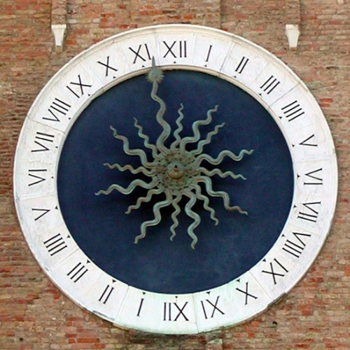

# L'OROLOGIO DA TORRE 


L'orologio da torre, nell'arco della storia, è un manufatto di pubblica utilità spesso voluto da governanti o dai vari Comuni e finanziato con fondi e sottoscrizioni pubbliche. 
Per una comunità gli orologi assolvono alla funzione di indicatori del tempo, in contesti che spaziano da luoghi di preghiere diurne e notturne, di prediche, di assemblea civica, di ingresso in città, 
di cantiere edile, scandiscono gli orari di compra-vendita nelle piazze di mercato,fino ad aule universitarie, aule di tribunale, a luoghi di tortura o di esecuzioni capitali. La dimensione pubblica dell'orologio da torre è legata al fatto che si tratta di un portato tecnologico spesso finanziato, mantenuto e riparato a spese della comunità stessa. Costituisce uno strumento e un arredo urbano di prestigio unanimemente apprezzato. La complessità e data dal fatto che è formato da più parti, di dimensioni spesso monumentali. La parte meccanica consiste nel movimento, talora collegato a campane e automi, cui si accompagna spesso una parte grafica, la mostra. Le ruote orarie vanno annoverate tra i primi, se non il primo, oggetto pensato per comunicare un dato (variabile) ed essere letto e utilizzato da una comunità. Nelle vedute invece gli orologi diventano elementi in grado di connotare e fornire una memoria storica. 

L'orologio meccanico, la stampa e la polvere da sparo sono ritenute tra le innovazioni tecnologiche di importanza capitale per il mondo occidentale dell'era pre-industriale. La velocità di diffusione dell'orologio pubblico in Europa è considerata seconda solo a quella della stampa. 

Il piu antico orologio da torre in ferro è il noto esemplare inglese della Cattedrale di Saint Mary di Salisbury, documentato in un contratto di affitto del 1386. Ma anche Chioggia vanta uno dei due meccanismi di orologio da torre piu` antichi del mondo, costruito nel 1386.

```{r, echo=FALSE, fig.cap = "L’orologio della Torre di Sant'Andrea si trova a Chioggia, in provincia di Venezia, ed è l’orologio di origine medievale funzionante più antico del mondo.", out.width = '50%', out.height='50%', fig.align = 'center'}

```


I Paesi europei, hanno predisposto degli archivi online, per offrire l'accesso e la diretta consultazione dei manufatti di orologeria considerati patrimonio storico- culturale di un territorio.