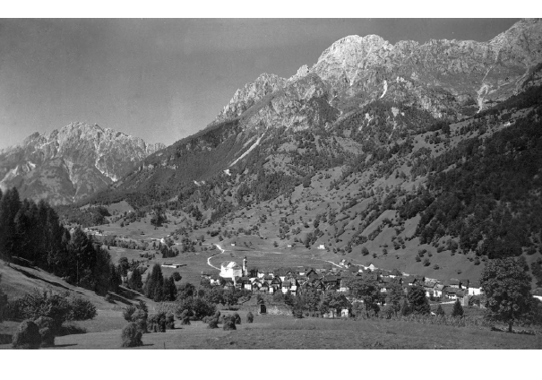
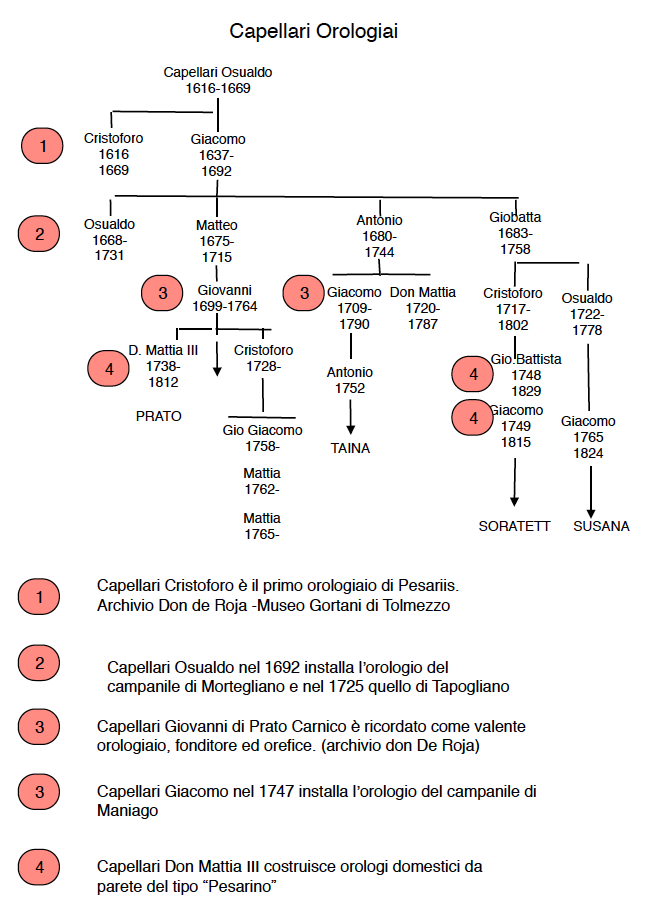

# LE BOTTEGHE DI OROLOGERIA A PESARIIS

(ref:paesi) La Valle del Tempo

```{r paesi, echo = F, fig.pos = 'H', out.width = '90%', out.height = '90%', fig.align = 'center', auto_pdf = TRUE, fig.cap='(ref:paesi)'}

```

Pesariis è un piccolo borgo montano della Carnia, in provincia di udine, ai confini con l'Austria. Oggi è stato ribattezzato il paese degli orologi. Attraverso il Museo, che ricostruisce la storia dell'orologeria pesarina e il percorso degli orologi monumentali, lungo le vie del paese, si racconta la storia della misura del tempo. L’interesse del luogo deriva poi dal suo impianto urbanistico. Suggestive stradine dagli antichi selciati, piccole piazze, stavoli con strutture in muratura e fienili aggentanti in legno, sottopassaggi e, ovunque, dettagli di un’antica civiltà e delle sue molteplici sfaccettature. E’ lultima frazione della val Pesarina ed è collegato alla Pusteria da un'antica via commerciale. San candido e Lienz si trovano su questa direttrice verso il Norico, che viene raggiunto attraverso il passo Lavardet. Il suo sviluppo ebbe inizio nel XV secolo con il passaggio dal dominio patriarcale a quello della serenissima che avviò un intenso sfruttamento delle risorse forestali nel suo territorio. Venezia, con il suo emporio, diventò il centro per il rifornimento dei Cramars cargnelli che crearono delle reti commerciali per la vendita delle spezie e dei tessuti in lana e lino in Europa e in Istria. Il processo di crescita economica continuò con l'affermarsi di una specifica attività artigianale, quella famosa orologeria pesarina espressa con gli orologi da parete ad uso domestico e con i grandi meccanismi degli orologi da torre per campanili e palazzi civici, culminata con la fabbrica dei fratelli Solari. 
Negli atti notarili ( cosi come conservati nela biblioteca privata di Luciano Petris di Pesariis) si legge che, alla morte di Battista Gonano (1619), il lascito agli eredi comprende “mulini,fucina et siega, et l’orto che è appresso alla siega” (5). Due anni dopo (14 settembre 1621), la stessa proprietà viene suddivisa fra tre fratelli : Agostino,Giovanni e Pascolo, due dei quali assegnatari della fucina con battiferro con tutti gli altri suoi “ordegni”. 
Il 7 dicembre 1621 Giovanni acquista da Agostino parte della fucina della quale si hanno nuovamente notizie il 16 aprile 1691 quando Iacopo Capellari acquista la fucina dal suocero Osvaldo Gonano. 
Iacopo Capellaro è fratello di quel Cristoforo che nell'albero genealogico della famiglia Capellari è indicato come “ l’orloiaro” ed è anche padre di quell’ Osvaldo Capellaro al quale è stato commissionato, nel 1690, l’orologio da torre di Mortegliano e, nel 1730, unitamente al nipote Giacomo la costruzione dell’orologio di Salcano (Gorizia) e, circa quattro anni prima, quella di Tapogliano frazione di Campolongo al Torre. Tenendo in evidenza le relazioni tra territori si puoí ipotizzare che l’apprendistato di orologeria di Cristoforo Capellari sia avvenuto in questa area presso un "Uhrmachermeister"" del Tirolo


(ref:orlojaro) Cristoforo Capellaro "orlojaro" a Pesariis

```{r orlojaro, echo = F, fig.pos = 'H', out.width = '90%', out.height = '90%', fig.align = 'center', auto_pdf = TRUE, fig.cap='(ref:orlojaro)'}

```


