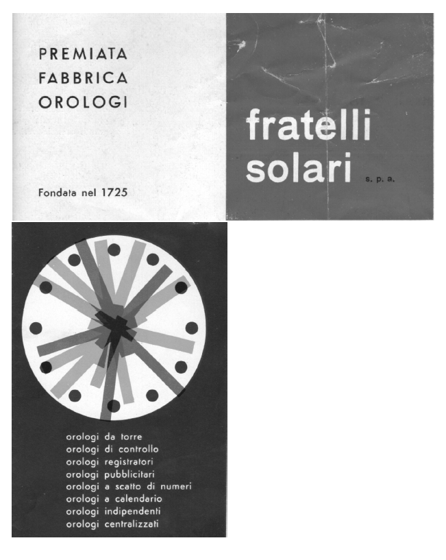

#  L'INDUSTRIA ELETTROMECCANICA - dal 1946 al 1960


(ref:logociro) Marchio Solari spa

```{r logociro, echo = F, fig.pos = 'H', out.width = '90%', out.height = '90%', fig.align = 'center', auto_pdf = TRUE, fig.cap='(ref:logociro)'}

```


La società di nome collettivo f.lli Solari con l'uscita dei cugini Fermo.Remigio,Remo ed Ugo ha come soci i fratelli Solari figli di Giovanni Ciro,Alfeo ed Alceo. Nel 1953 si trasforma in società per azioni con l'ingresso dell' ing.Elio Cappellari ,cognato di Alfeo . Ultimo di 8 figli, studia ingegneria elettrotecnica a Trieste dove si laurea nel 1952.Oltre a questa figura si aggiungono due tecnici Sisto Solari e Bruno Solari.
Nel 1998 la f.lli Solari sarà incorporata nella Solari di Udine.

Dal 1943 al 1945, a causa della seconda guerra mondiale, l’attività dell’azienda viene interrotta.
Dal 1946 al 1953,  l’azienda continua la sua attività eseguendo importanti commesse per le Ferrovie dello Stato che comprendevano centrali orarie,orologi ricevitori da pensilina e orologi registratori a 20 puntine scriventi . 

Nel 1953, il 5 settembre,  la F.lli Solari SPA ( vedi registro imprese CCIA) si trasforma in società per azioni con un capitale sociale di 21 milioni. Esso viene diviso in parti uguali tra i 3 soci: Ciro, Alceo e Alfeo.
Il Consiglio di amministrazione risulta formato da Ciro Solari, presidente,  Elio Cappellari vice-presidente e Alfeo Solari, consigliere. 

L’Azienda conta  40 dipendenti, per lo più residenti in valle, ma anche in Val Degano.

Nell'azienda viene inserita la funzione di progettazione e di direzione tecnica ricoperta dall'ing.Elio Cappellari. La direzione della produzione viene assunta dal tecnico Sisto Solari, che rientrava nell'azienda di Pesariis, dopo aver svolto la stessa funzione presso la Fabbrica Orologeria Industriale Solari Remigio con sede a Udine.
Ciro Solari si occupa della direzione amministrativa e della vendita, Alceo della gestione del personale e delle spedizioni, Alfeo e Sisto Solari si dividono i compiti della produzione e del reparto prove e collaudo.

Ciro, figlio di Giovanni,  primogenito di 7 figli, assume la direzione dell'azienda scegliendo i settori di sviluppo e ridisegnando il mercato che
sarà rivolto all'orologeria elettrica degli Enti Pubblici ed in particolare di quello delle Ferrovie dello Stato. 
I rapporti con questi Enti vengono consolidati grazie alle relazioni che riesce a tessere con i funzionari dirigenti ed alla collaborazione tecnica che riesce a consolidare grazie alla qualità tecnica e di affidabilità dei prodotti forniti.
La decisione di allargare la compagine sociale permette la condivisione delle scelte con nuove professionalità. Si affrontano in tal modo  le nuove sfide del mercato ed il passaggio dall'orologeria meccanica all'orologeria elettromeccanica.

Alceo, gemello di Alfeo, esprime con efficacia le sue doti organizzative nel coordinare le attività di spedizione delle merci, nel rapporto con i fornitori e nella direzione e gestione amministrativa del personale.

Alfeo, ricordato come un imprenditore è un tecnico orologiaio, con competenze multiple che comprendono le tecniche di fusione, di trattamento termico dei metalli, di lavorazioni su macchine utensili di grande precisione e di esecuzione dei collaudi per gli orologi forniti alle Ferrovie nel rispetto degli standard prefissati.
 Con la competenza tecnica acquisita e con la passione nell’arte orologiaia, trasmette il sapere pratico  alle nuove generazioni di apprendisti assunti in azienda. Il periodo di apprendistato ha la durata di cinque anni. Il personale che lavora in azienda e che poi decide di emigrare all’estero, al ritorno al paese, esprime un caloroso ringraziamento ad Alfeo per le competenze tecniche acquisite nella F.lli Solari. Le aziende svizzere di meccanica di precisione, in cui gli ex-operai della solari hanno prestato la loro opera, riconoscono le loro capacità affidando loro le lavorazioni più complesse. 

L’innovazione in azienda, dopo l’uscita del genio Remigio, è resa possibile grazie all’ingresso dell’ing. Elio Cappellari. La sua specializzazione in elettrotecnica e la sua capacità inventiva consente di costruire prodotti elettromeccanici competitivi nel campo dell’orologeria industriale.

La specializzazione in elettrotecnica dell'ing. Elio Cappellari e le sue doti inventive permettono all'azienda F.lli Solari di rinnovare tutta la gamma dell'orologeria elettrica. Questa linea di prodotti viene offerta agli enti pubblici e alle medie e grosse aziende che si dotano di sistemi di orologeria centralizzata.
 Molto richiesti dal mercato sono gli orologi a scheda per la rilevazione delle presenze che l'ing. Cappellari ha progettato rendendolo compatto con stampa degli orari di entrata/uscita  su scheda mensile e con timbratura automatica.
Le sue doti e capacità vengono confermate nella progettazione di un orologio a calendario che consente di svolgere in modo automatico il calcolo degli anni bisestili, dei giorni variabili dei mesi, dell’indicazione dei giorni della settimana e giornalmente delle ore e  minuti.


(ref:elio) Orologio di controllo per la rilevazione presenze

```{r elio, echo = F, fig.pos = 'H', out.width = '90%', out.height = '90%', fig.align = 'center', auto_pdf = TRUE, fig.cap='(ref:elio)'}
knitr::include_graphics('immagini/controlloelio.png')
```


Per migliorare e far evolvere le competenze degli operai, d’intesa con Alfeo, istituisce dei corsi di formazione sulla tecnologia e il disegno,  che saranno svolti ogni sabato mattina.

La F.lli Solari con questi nuovi prodotti affronta il mercato dell’orologeria industriale presentandosi alle fiere di Milano e di Bologna. Nelle Fiere vengono scelti gli agenti della ditta che si occuperanno della vendita e dell’assistenza degli orologi di controllo.


